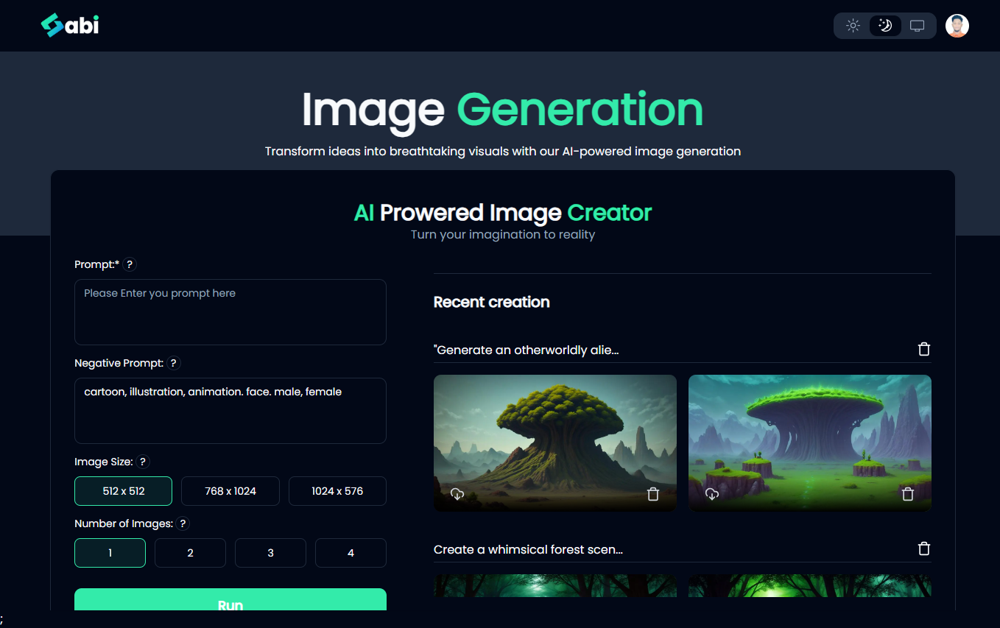
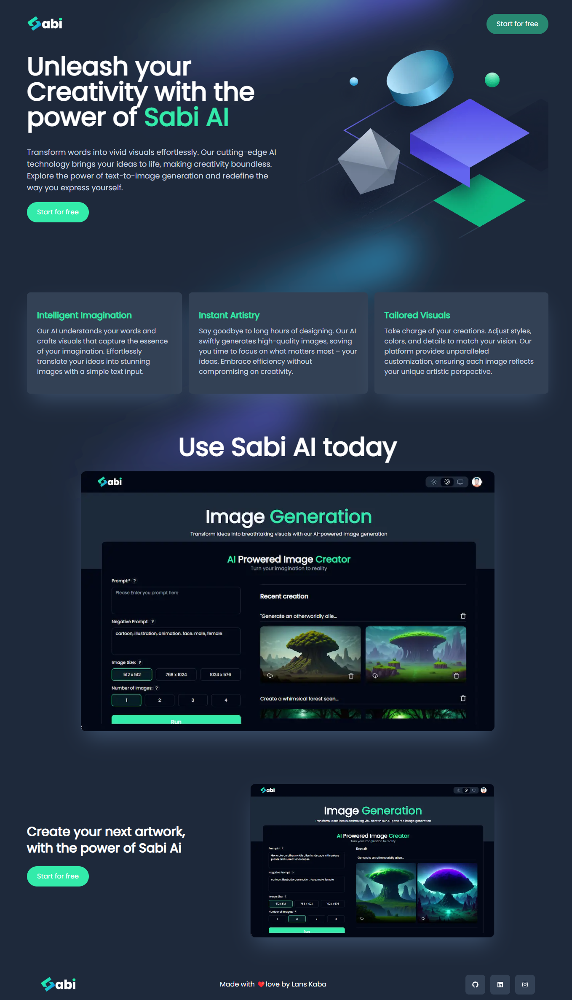

# AI Text-to-Image Generation

Unleash your creativity with my AI-powered text-to-image generation tool using fal ai. Transform words into vibrant visuals effortlessly.

## Features

- **Intuitive Creativity:** It understands your words and crafts visuals that capture the essence of your imagination.

- **Customization Control:** Take charge of your creations. Adjust styles, colors, and details to match your vision.

- **Time Efficiency:** Swiftly generate high-quality images, saving you time to focus on your ideas.
- **Store :** All generated images are stored and can be downloaded for future use.

## Installation

Follow these steps to get started:

1. Clone the repository: `git clone https://github.com/yourusername/your-repo.git`
2. Navigate to the project directory: `cd your-repo`
3. Install dependencies: `npm install`
4. Environment Variables
   Ensure you have the following environment variables set up:

```env
FAL_KEY=XXXXXXX

NEXT_PUBLIC_CLERK_PUBLISHABLE_KEY=XXXXXXX
CLERK_SECRET_KEY=XXXXXXX
NEXT_PUBLIC_CLERK_SIGN_IN_URL=/sign-in
NEXT_PUBLIC_CLERK_SIGN_UP_URL=/sign-up
NEXT_PUBLIC_CLERK_AFTER_SIGN_IN_URL=/image
NEXT_PUBLIC_CLERK_AFTER_SIGN_UP_URL=/image

MONGO_URL=XXXXXXX
```

Replace XXXXXXX with your actual keys and URLs.

5. Run the application: `npm run dev`

## Usage

1. Customize the input text in the provided field.
2. Click on the "Generate Image" button to see the magic happen.
3. Explore customization options for fine-tuning your visual creation.

## Screenshot


_Screenshot 1_

Landing page 1

Thank you
